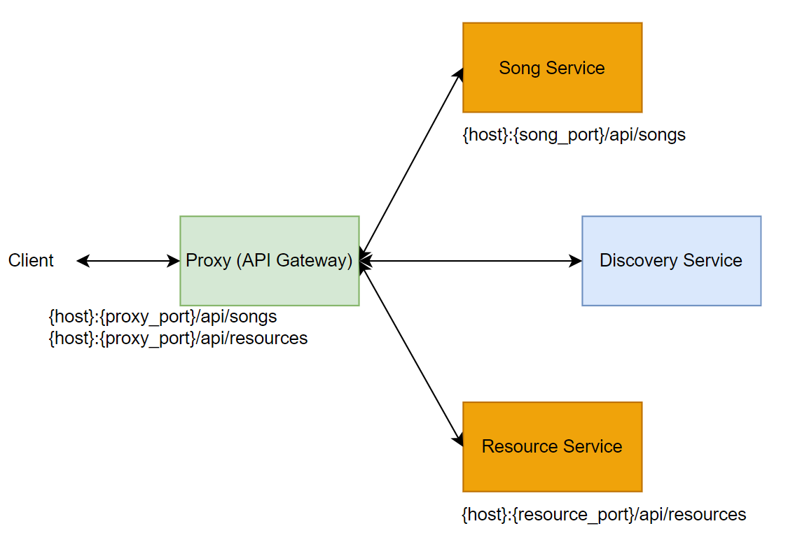

# MAO-song-service

Java Spring Boot Application to work with Song Entity.
High-level overview:

## Other components:
1. [API Gateway](https://github.com/LizaSamodumkina/SD-cloud-gateway-service)
2. [Discovery Service](https://github.com/LizaSamodumkina/SD-eureka-discovery-service)
3. [Resource Service](https://github.com/LizaSamodumkina/MAO-resource-service)

## How's to

To create PostgreSQL database in Docker run [start-postgres.cmd](docker%2Fstart-postgres.cmd). 

To run application locally use `local` as Spring profile.

To define properties for non-local run use [.env](.env).

### Containerization

Build an image

`docker build -t microservices/song .`

Create and run container

`docker run -p 8091:8091 microservices/song`

Run docker-compose

`docker-compose up -d --build`